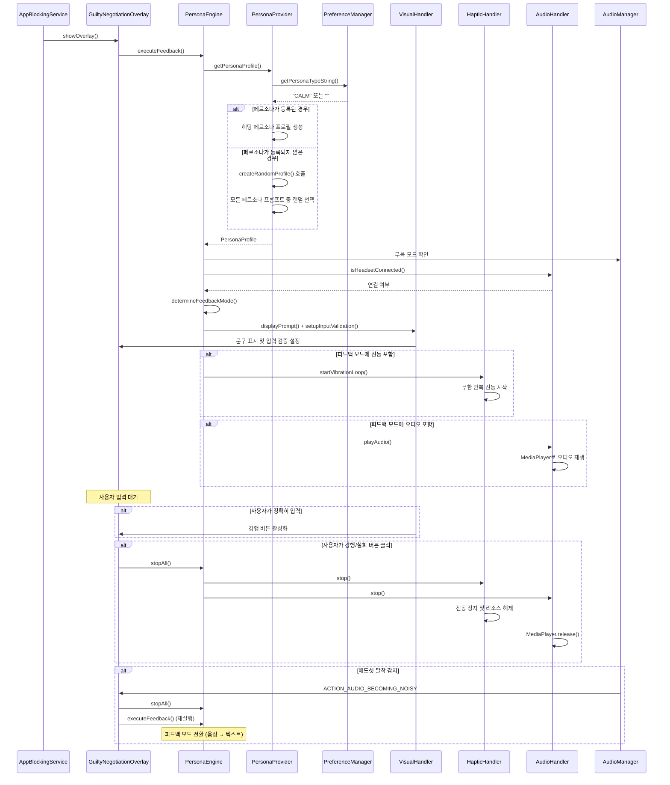

# Domain Layer & Persona Module 아키텍처

## 책임 (Responsibilities)

Domain Layer는 비즈니스 로직과 규칙을 담당합니다. Persona Module은 사용자에게 맞춤형 피드백을 제공하는 핵심 모듈입니다.

---

## Business Logic Layer

### 1. PenaltyService

**파일**: [`app/src/main/java/com/faust/domain/PenaltyService.kt`](app/src/main/java/com/faust/domain/PenaltyService.kt)

- **책임**: 페널티 계산 및 적용 (주로 철회 시 사용)
- **로직**:
  - 강행(Launch): 모든 티어 6분 차감 (`TimeCreditService.applyPenaltyMinutes(6)` 호출)
  - 철회(Quit): Free/Standard 티어 3분 차감 (Time Credit 잔액 차감)
  - 잔액 부족 시 0으로 클램프
- **주요 메서드**:
  - 강행 페널티: `GuiltyNegotiationOverlay`에서 `TimeCreditService(context).applyPenaltyMinutes(6)` 직접 호출
  - `applyQuitPenalty()`: 철회 페널티 적용 (화면 OFF 도주 감지 시에도 사용, PreferenceManager Time Credit 차감)
  - `executeForcedMediaTermination(packageName)`: Credit 소진 + 화면 OFF + 오디오 차단 시 배경 미디어 강제 정지(오디오 포커스 요청, KEYCODE_MEDIA_PAUSE 전송), 3회 짧은 진동, 로그
- **데이터 정합성**:
  - Time Credit 잔액은 PreferenceManager만 사용 (DB 트랜잭션 없음)
  - `PreferenceManager.getTimeCreditBalance()` / `setTimeCreditBalance()`
- **에러 처리**:
  - 예외 처리 및 로깅

### 2. WeeklyResetService

**파일**: [`app/src/main/java/com/faust/domain/WeeklyResetService.kt`](app/src/main/java/com/faust/domain/WeeklyResetService.kt)

- **책임**: 주간 정산 로직
- **스케줄링**: `AlarmManager`로 매주 월요일 00:00 실행
- **데이터 정합성**:
  - `database.withTransaction`으로 포인트 조정과 거래 내역 저장을 원자적으로 처리
  - DB에서 현재 포인트 계산 (`PointTransactionDao.getTotalPoints()`)
  - PreferenceManager는 호환성을 위해 동기화만 수행
- **에러 처리**:
  - 트랜잭션 내부 예외 처리 및 로깅
  - 실패 시 자동 롤백 및 재시도 스케줄링

### 3. DailyResetService

**파일**: [`app/src/main/java/com/faust/domain/DailyResetService.kt`](app/src/main/java/com/faust/domain/DailyResetService.kt)

- **책임**: 일일 초기화 로직 (스탠다드 티켓 일일 사용 횟수 초기화)
- **스케줄링**: `AlarmManager`로 매일 사용자 지정 시간에 실행 (기본값: 00:00)
- **사용자 지정 시간 지원**:
  - `PreferenceManager.getCustomDailyResetTime()`으로 사용자 지정 시간 조회
  - `TimeUtils.getNextResetTime(customTime)`으로 다음 리셋 시간 계산
  - 시간 변경 시 알람 재스케줄링
- **데이터 정합성**:
  - `database.withTransaction`으로 일일 사용 기록 초기화를 원자적으로 처리
  - 사용자 지정 시간 기준으로 날짜 계산 (`TimeUtils.getDayString()`)
- **에러 처리**:
  - 트랜잭션 내부 예외 처리 및 로깅
  - 실패 시 자동 롤백

### 4. TimeCreditService

**파일**: [`app/src/main/java/com/faust/domain/TimeCreditService.kt`](app/src/main/java/com/faust/domain/TimeCreditService.kt)

- **책임**: 시간 크레딧 정산 및 사용 세션 관리
- **주요 기능**:
  - 정산 처리: `settleCredits()`로 일괄 정산 (화면 ON 시 누적된 금욕 시간을 크레딧으로 변환)
  - 세션 관리: `startCreditSession()`/`endCreditSession()`로 크레딧 사용 세션 시작/종료
  - 가용성 확인: `isCreditAvailable()`로 크레딧 사용 가능 여부 확인
  - 쿨다운 확인: `isInCooldown()`로 쿨다운 상태 확인
- **생성자**: Context 기반 생성자 사용
- **정산 로직**:
  - `TimeCreditBackgroundService`에서 누적된 절제 시간(분)을 PreferenceManager에 유지
  - `MainActivity`에서 앱 포그라운드(STARTED) 시 1회 + 60초마다 `TimeCreditService.settleCredits()` 호출하여 크레딧 잔액 실시간 반영
  - 비율에 따라 크레딧 적립 (예: 1분 = 1 크레딧)
- **세션 플로우**:
  - `AppBlockingService`가 차단 앱 감지 시 `TimeCreditService.startCreditSession()` 호출
  - `TimeCreditBackgroundService`가 1분마다(경과 시간 기준) 잔액에서 1 크레딧 차감
  - **화면 OFF 시 최종 차감**: 틱 취소 전 `performFinalDeductionOnScreenOff()`로 남은 초(부분 분) 즉시 차감
  - **Exhaustion Timer**: 잔액 소진 시점을 `Handler.postDelayed`로 예약하여 정확한 시점에 `endCreditSession()` 및 즉시 차단 오버레이(`onCreditExhausted` 콜백) 실행
  - 사용자가 앱을 떠나거나 크레딧이 소진되면 `endCreditSession()` 호출
- **서비스 생존**: `TimeCreditBackgroundService.isServiceRunning()`으로 접근성 레이어(`AppBlockingService.onServiceConnected`, 앱 실행 플로우)에서 서비스 없으면 `startService()` 재기동
- **데이터 정합성**:
  - Time Credit 잔액·누적 절제 분·Credit Session은 PreferenceManager만 사용 (DB 트랜잭션 없음)
- **에러 처리**:
  - 예외 처리 및 로깅

### 5. AppGroupService

**파일**: [`app/src/main/java/com/faust/domain/AppGroupService.kt`](app/src/main/java/com/faust/domain/AppGroupService.kt)

- **책임**: 앱 그룹 관리 (SNS/OTT 앱 분류)
- **주요 기능**:
  - SNS 앱 그룹: `CATEGORY_SOCIAL` + 특정 패키지명 추가/제외
  - OTT 앱 그룹: `CATEGORY_VIDEO` + 특정 패키지명 추가/제외
  - 앱이 특정 그룹에 속하는지 확인 (카테고리 기반 + 명시적 포함/제외)
  - 초기 데이터 설정 (주요 SNS/OTT 앱 패키지명)
- **초기화 타이밍**: 앱 첫 실행 시 또는 AppGroupService 초기화 시 자동 설정 (데이터가 없을 때만)


### 7. StrictModeService

**파일**: [`app/src/main/java/com/faust/domain/StrictModeService.kt`](app/src/main/java/com/faust/domain/StrictModeService.kt)

- **책임**: 엄격모드 상태 관리 및 타이머 로직
- **주요 기능**:
  - 엄격모드 활성화 및 자동 해제 스케줄링
  - 절대 시간 계산법을 사용한 정확한 시간 관리
  - AlarmManager를 통한 백그라운드 자동 해제
- **절대 시간 계산법**:
  - **활성화 시**: 현재 시각(`System.currentTimeMillis()`)에 설정한 분을 더하여 **절대 종료 시각(EndTime)**을 계산하고 PreferenceManager에 저장
  - **시간 계산 공식**: `RemainingTime = EndTime - CurrentTime`
  - **활성 상태 확인**: `isStrictActive()`에서 `currentTime >= endTime` 조건으로 확인
  - **앱 종료 여부와 무관**: 앱이 꺼져있어도 저장된 EndTime과 시스템 현재 시각을 비교하여 실시간으로 차단 여부를 결정
- **AlarmManager 통합**:
  - `setExactAndAllowWhileIdle()` 사용 (Android 12+ 권한 확인 포함)
  - 도즈 모드(Doze Mode)에서도 정확한 EndTime에 엄격모드가 해제되도록 보장
  - `StrictModeExpiredReceiver`를 통해 만료 시 자동 해제 처리
- **MainFragment 연동**:
  - `onResume()`에서 `getRemainingTime()`으로 남은 시간 재계산
  - CountDownTimer를 사용하여 실시간 UI 업데이트
    - 1분 이상: 1분 간격, 분 단위 표시
    - 1분 미만: 1초 간격, 초 단위 표시
  - 시간 만료 시(`onFinish()`) 엄격모드 해제 및 초기 상태로 복귀
- **비상구 기능 (`processEmergencyExit()`)**:
  - 남은 시간에 따라 구간별 차등 보상을 제공하는 게임 이론 기반 시스템
  - **구간별 처리 로직**:
    - `remMin <= 5분`: 즉시 엄격모드 해제 (`disableStrictProtection()` 호출, 쿨타임 저장하지 않음)
    - `remMin < 10분`: 종료 시간을 5분 앞당기고, 쿨타임 5분 적용
    - `remMin < 15분`: 종료 시간을 5분 앞당기고, 쿨타임 5분 적용
    - `remMin < 20분`: 종료 시간을 5분 앞당기고, 쿨타임 5분 적용
    - `remMin >= 20분`: 절반 단축 (`EndTime = 현재시각 + (remMin / 2)분`), 점진적 쿨타임 계산식: `cooldownMinutes = min(20, 5 + ((remMin - 20) / 2))`
  - **쿨타임 관리**:
    - `PreferenceManager`에 `last_click_time`과 `cooldownMinutes` 저장
    - 첫 사용 시 (`last_click_time == 0L`) 쿨타임 체크 스킵
    - 쿨타임 중에는 비상구 사용 불가 (버튼 클릭 시점과 다이얼로그 내부 이중 체크)
  - **엣지 케이스 처리**:
    - `remainingTime <= 0`: 이미 해제된 상태로 실패 반환
    - `newEndTime <= currentTime`: 즉시 해제 처리
  - **AlarmManager 재예약**: 기존 알람 취소 후 새로운 `EndTime`으로 재등록
  - **결과 반환**: `EmergencyExitResult` 데이터 클래스로 처리 결과 반환 (성공 여부, 즉시 해제 여부, 줄어든 시간, 쿨타임, 메시지)
- **보안 고려사항**:
  - EncryptedSharedPreferences를 사용하여 EndTime 저장 (사용자 임의 수정 방지)
  - TODO: 시스템 시간 변경 취약점 보완 방안 검토 (SystemClock.elapsedRealtime() 병행 사용 또는 NetworkTime 라이브러리 도입)

---

## Persona Module

### 개요

Persona Module은 사용자가 선택한 페르소나에 따라 차단된 앱 실행 시 다양한 피드백(시각, 촉각, 청각)을 제공합니다. 능동적 계약 방식을 통해 사용자가 정확히 문구를 입력해야 강행 버튼이 활성화됩니다.

### 1. PersonaEngine

**파일**: [`app/src/main/java/com/faust/domain/persona/PersonaEngine.kt`](app/src/main/java/com/faust/domain/persona/PersonaEngine.kt)

- **책임**: 기기 상태와 페르소나 프로필을 조합하여 최적의 피드백 모드를 결정하고 각 핸들러에게 실행 명령을 내립니다
- **Safety Net 로직**:
  - 무음 모드 + 헤드셋 없음 → `TEXT_VIBRATION`
  - 소리 모드 + 헤드셋 있음 → `ALL`
  - 무음 모드 + 헤드셋 있음 → `TEXT_VIBRATION`
  - 기타 → `TEXT`
- **주요 메서드**:
  - `determineFeedbackMode()`: 기기 상태 기반 피드백 모드 결정
  - `executeFeedback()`: 피드백 실행 (시각, 촉각, 청각)
  - `stopAll()`: 모든 피드백 즉시 정지 및 리소스 해제

### 2. PersonaProvider

**파일**: [`app/src/main/java/com/faust/domain/persona/PersonaProvider.kt`](app/src/main/java/com/faust/domain/persona/PersonaProvider.kt)

- **책임**: PreferenceManager에서 사용자가 선택한 페르소나 타입을 읽어와 해당하는 PersonaProfile을 제공합니다
- **페르소나 타입**:
  - `STREET`: 불규칙 자극 (빠른 리듬 진동)
  - `CALM`: 부드러운 성찰 (부드러운 진동)
  - `DIPLOMATIC`: 규칙적 압박 (규칙적 진동)
  - `COMFORTABLE`: 편안한 위로 (부드럽고 편안한 피드백)
- **등록되지 않은 경우 (랜덤 텍스트)**:
  - `getPersonaType()`가 `null`을 반환하면 `createRandomProfile()` 호출
  - 모든 페르소나 타입의 프롬프트 텍스트를 수집
  - 랜덤으로 하나 선택하여 PersonaProfile 반환
  - 진동 패턴: 기본값 `listOf(200, 200, 200)`
  - 오디오: `null`
- **주요 메서드**:
  - `getPersonaProfile()`: 현재 설정된 페르소나 프로필 반환 (등록되지 않은 경우 랜덤)
  - `getPersonaType()`: PreferenceManager에서 페르소나 타입 읽기 (등록되지 않은 경우 `null`)
  - `createRandomProfile()`: 모든 페르소나의 프롬프트 텍스트 중 랜덤 선택

### 3. VisualHandler

**파일**: [`app/src/main/java/com/faust/domain/persona/handlers/VisualHandler.kt`](app/src/main/java/com/faust/domain/persona/handlers/VisualHandler.kt)

- **책임**: 페르소나가 제시하는 문구를 화면에 표시하고 사용자 입력을 검증합니다
- **능동적 계약 방식**: 사용자가 정확히 문구를 입력해야 강행 버튼이 활성화됩니다
- **주요 기능**:
  - `displayPrompt()`: 문구 표시
  - `setupInputValidation()`: 실시간 입력 검증 (TextWatcher)

### 4. HapticHandler

**파일**: [`app/src/main/java/com/faust/domain/persona/handlers/HapticHandler.kt`](app/src/main/java/com/faust/domain/persona/handlers/HapticHandler.kt)

- **책임**: 페르소나별 진동 패턴을 무한 반복으로 실행합니다
- **구현**: `VibrationEffect` 사용 (API 26+)
- **리소스 관리**: `stop()` 호출 시 Job 취소 및 Vibrator.cancel()

### 5. AudioHandler

**파일**: [`app/src/main/java/com/faust/domain/persona/handlers/AudioHandler.kt`](app/src/main/java/com/faust/domain/persona/handlers/AudioHandler.kt)

- **책임**: res/raw의 로컬 오디오 파일을 MediaPlayer로 재생합니다
- **헤드셋 감지**: AudioManager를 통한 헤드셋 연결 상태 확인
- **리소스 관리**: `stop()` 호출 시 MediaPlayer.release() 보장

---

## Persona 피드백 플로우



---

## 의존성 그래프

```
PenaltyService
  ├─► FaustDatabase
  └─► PreferenceManager

WeeklyResetService
  ├─► FaustDatabase
  └─► PreferenceManager

PersonaEngine
  ├─► PersonaProvider
  │   └─► PreferenceManager
  ├─► VisualHandler
  ├─► HapticHandler
  │   └─► Vibrator (시스템)
  └─► AudioHandler
      ├─► MediaPlayer
      └─► AudioManager (시스템)
```

---

## 변경 이력 (Document History)

- 2025-02-07: Credit 차감 보강 — 화면 OFF 시 최종 차감, Exhaustion Timer, 서비스 생존 재기동. (TimeCreditBackgroundService, AppBlockingService, arch_domain_persona)

---

## 관련 문서

- [마스터 아키텍처 문서](../ARCHITECTURE.md)
- [프레젠테이션 레이어 아키텍처](./arch_presentation.md)
- [데이터 레이어 아키텍처](./arch_data.md)
- [이벤트 정의 문서](./arch_events.md)
