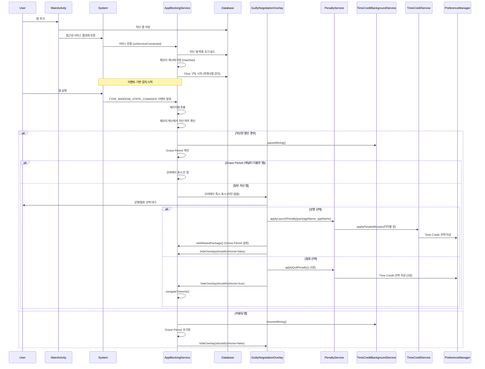
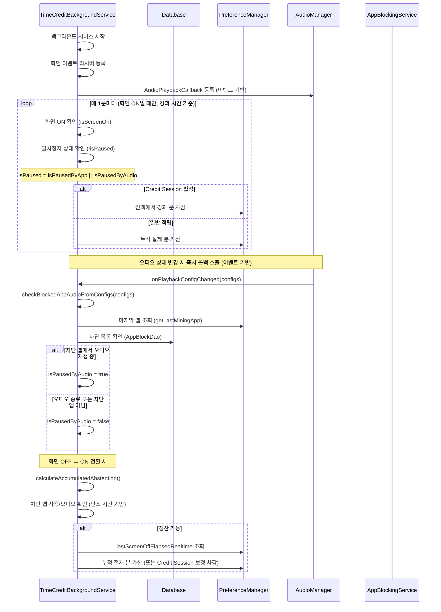
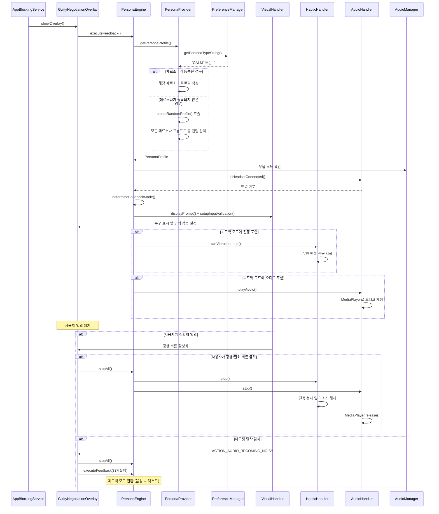
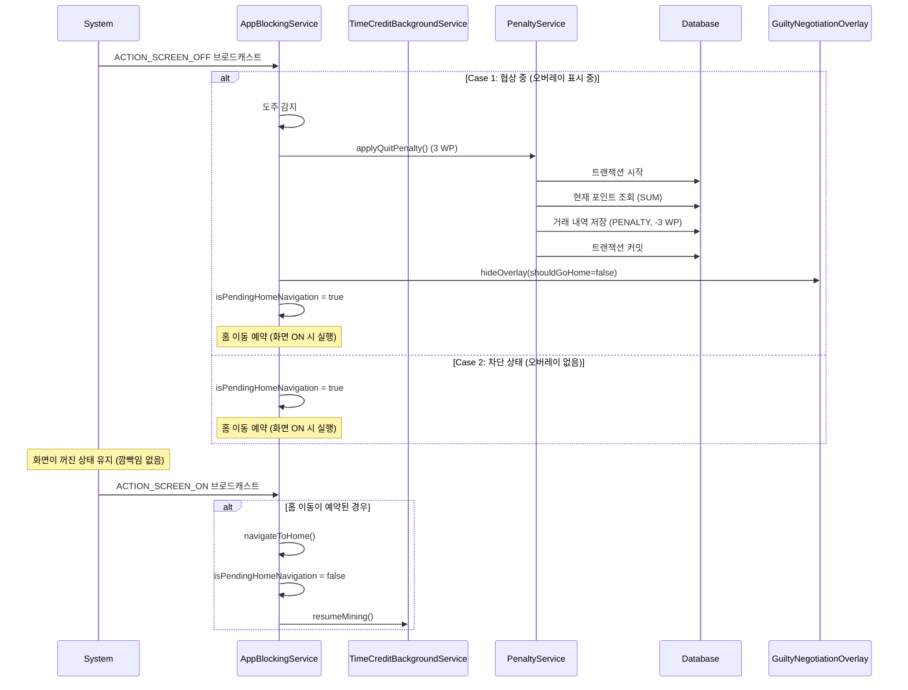
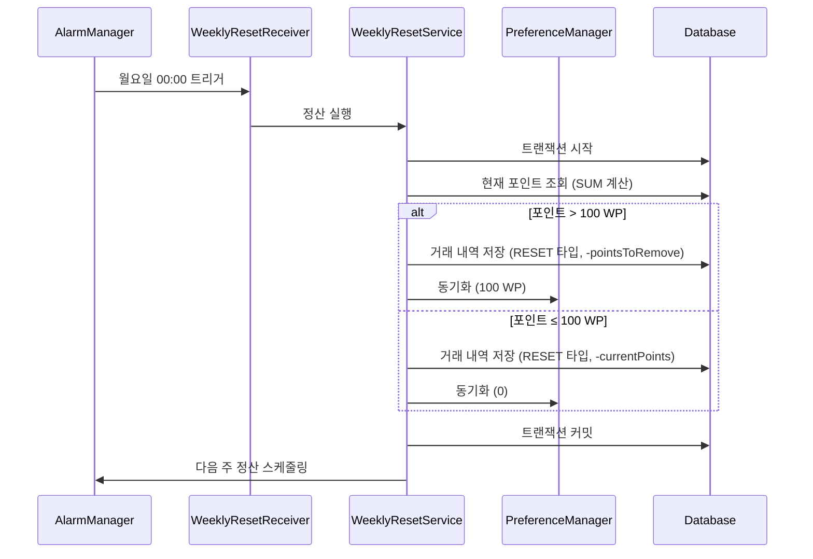
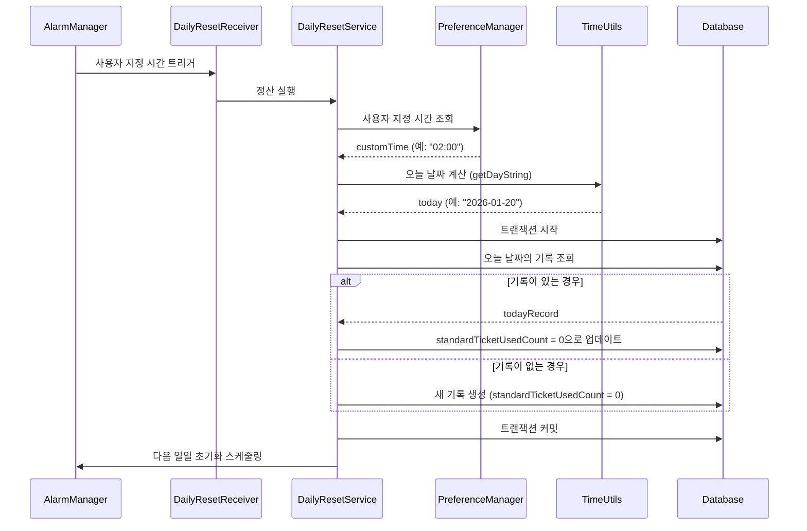
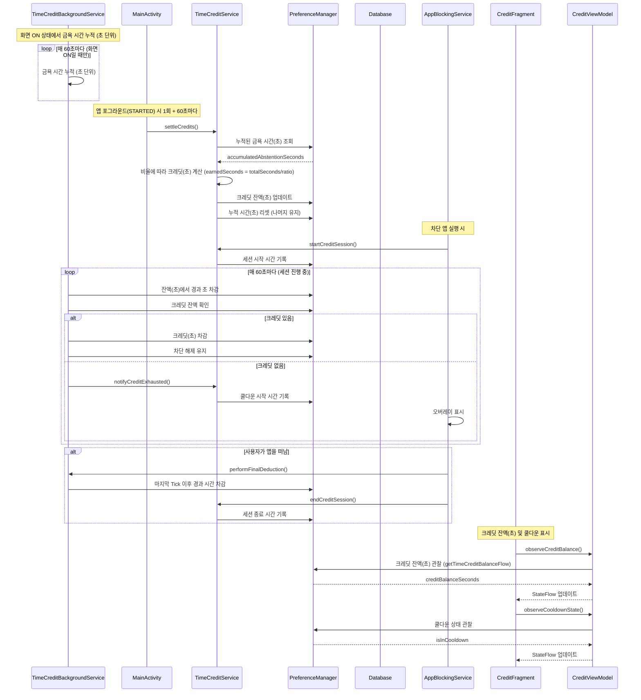
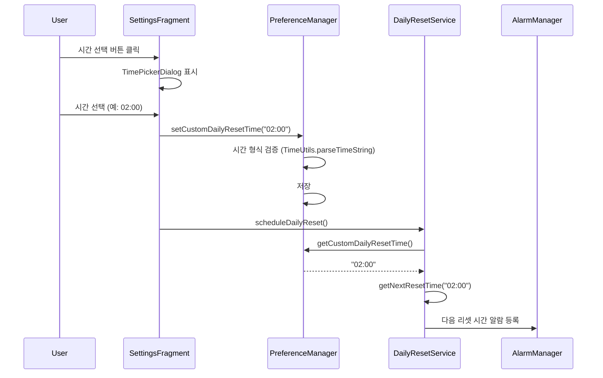

# 핵심 이벤트 정의 및 시퀀스 다이어그램

## 책임 (Responsibilities)

이 문서는 Faust 앱의 비즈니스 로직을 트리거하는 주요 이벤트들과 시스템 컴포넌트 간의 상호작용을 시퀀스 다이어그램으로 설명합니다.

### 변경 이력

- **[2026-02-08]** 휴면 판단을 lastKnownForegroundPackage로 전환(대안1): (1) PreferenceManager에서 `isCreditSessionDormant`/`setCreditSessionDormant` 제거. (2) TimeCreditBackgroundService: 메모리 전용 `lastKnownForegroundPackage` 도입(미 persist). `requestDormant(targetPackageName)`으로 변경, 이미 휴면(lastKnown != sessionPackage)이면 갱신·알람만 하고 정산 스킵(순서: 판단 후 갱신). `syncState()`에서 usage=0 조건을 `sessionPkg == null || lastKnownForegroundPackage != sessionPkg`로 통일. (3) `setLastKnownForegroundPackage(packageName)` 노출, TimeCreditService.startCreditSession에서 신규·재진입 시 호출. 영향: PreferenceManager, TimeCreditBackgroundService, AppBlockingService, TimeCreditService, arch_events.
- **[2026-02-08]** 휴면(Dormant) 구간 이중 차감 방지: (1) PreferenceManager에 `isCreditSessionDormant`/`setCreditSessionDormant` 추가; 세션 비활성화 시 자동 해제. (2) TimeCreditBackgroundService: `requestDormantInternal()`에서 이미 휴면이면 syncState 호출 없이 알람만 취소; `syncState("Dormant_Entry")`에서 이미 휴면이면 정산 스킵·lastSync만 갱신, 최초 휴면 시 정산 후 `setCreditSessionDormant(true)`; 일반 `syncState()`에서 휴면이면 usage=0으로 차감 생략(홈/비차단 앱 체류 시간 차감 방지). (3) TimeCreditService.startCreditSession: 신규·재진입 시 `setCreditSessionDormant(false)`. 영향: PreferenceManager, TimeCreditBackgroundService, TimeCreditService, arch_events.
- **[2026-02-08]** 진입점 축소 리팩터링 (2·3·4단계): (2) AppBlockingService: shouldEmitAppForegroundEvent, evaluateBlockingIntent, applyBlockingIntent; tryEndCreditSessionOnLeaveBlockedApp 필수 호출. (3) 화면 OFF/ON: TimeCreditBackgroundService만 수신, AppBlockingService는 setScreenOffEventCallback(immediate, audioResolved)·getScreenOffAudioCandidatePackage로 콜백만 수신; 처리 순서 1→2→3→4(200ms 오디오 확정) 고정. (4) 오디오: 진입점 4 전처리(Persona 제외)·정책(TCB)·액션(ABS.onAudioBlockStateChanged) 주석.
- **[2026-02-08]** 진입점 축소 리팩터링 (5단계): 크레딧 차감·소진 경로 일원화. `evaluateCreditAction(balanceAfter, durationSec, creditAtStart)`로 "소진 알림 필요 여부"만 판단; 세션 모니터, syncState→handleZoneTransition, 화면 OFF 1초 잡, 소진 타이머가 모두 이 함수를 거침. `notifyCreditExhausted()`는 ExhaustAndNotify일 때만 호출. handleZoneTransition은 syncStateLock 안에서 ExhaustAndNotify 반환만 하고, syncState가 락 해제 후 notifyCreditExhausted() 호출(데드락 방지). MainActivity 60초 settleCredits·tryRecoverSessionIfKilled 경로는 유지.
- **[2026-02-08]** 로그 직관화: 도메인 접두어([Lifecycle], [Credit], [Blocking], [UI]) 및 원인→결과 포맷 도입. `AppLog` 상수 및 키 로그 정비. 영향: `utils/AppLog.kt`, `TimeCreditService`, `MainActivity`, `AppBlockingService`, `TimeCreditBackgroundService`. 로그캣 필터 예: 메시지에 `[Credit]` 또는 `[Blocking]` 검색.
- **[2026-02-07]** 적응형 감시 구조 고도화: (1) 시간 기준 통일: lastSyncTime·사용량·복구·최종정산을 SystemClock.elapsedRealtime() 기준으로 전환(시계 조작/NTP 동기화 버그 차단). PreferenceManager에 getCreditSessionStartElapsedRealtime() 추가. (2) syncState(reason, balanceOverride): 구간 판정을 handleZoneTransition(balance, isDoze)로 분리. (3) 휴면 단일화: startGoldenTimeJob에서 오디오 공백 시 개별 알람 설정 대신 syncState("Dormant_Entry", balanceOverride) 호출. (4) Doze 모드: syncState 진입 시 isDisplayStateInteractive()로 Doze(3/4) 감지 시 필수 정산만 수행, 유예 알림·무거운 로직 생략. 영향: TimeCreditBackgroundService, TimeCreditService, PreferenceManager, arch_events.
- **[2026-02-07]** Adaptive Monitoring (60s threshold), syncState() 구간 판정, 정밀 감시 전환 알람(ACTION_PRECISION_TRANSITION), 휴면(Dormant) 시 세션 유지(96초 레이스 제거). §D.5 executeForcedMediaTermination 호출 조건: C≤0 판정 우선(오디오 중단으로 세션 종료 전 반드시 잔액 0 검사). 영향: TimeCreditBackgroundService, TimeCreditService, arch_events §4, §D.
- **[2026-02-07]** Final Enforcement Logic: Dynamic Branching on Screen ON. (1) Background: Credit 0 & Screen OFF → Kill Audio(executeForcedMediaTermination) → Mining 재개 시점 기록(PreferenceManager.lastMiningResumeElapsedRealtime). (2) Foreground Re-Entry: Screen ON 시 동기 정산(calculateAccumulatedAbstention + settleCredits) 후 콜백으로 AppBlockingService.onScreenOnSettlementDone() 호출; BLOCKED + 차단 앱 포그라운드면 balance ≤ 0 → showGuiltyNegotiationOverlay(Strict Punishment), balance > 0 → startCreditSession(packageName) + transitionToState(ALLOWED). (3) Logic Sync: Audio Kill~Screen ON 구간을 절제로 정산하여 잔액을 먼저 갱신한 뒤 재진입 분기 실행. 영향: PreferenceManager, TimeCreditBackgroundService, AppBlockingService, arch_events.md §4 화면 OFF/ON, §D.
- **[2026-02-07]** Credit 소진 시 강제 미디어 정지(Forced Media Termination): 트리거(잔액 0 + 화면 OFF + 오디오 차단) 시 PenaltyService.executeForcedMediaTermination()으로 오디오 포커스 요청, KEYCODE_MEDIA_PAUSE 전송, 3회 짧은 진동, D/PenaltyService 로그. 영향: PenaltyService, TimeCreditBackgroundService.notifyCreditExhausted(), arch_events.md §D.5, arch_domain_persona.md PenaltyService.
- **[2026-02-07]** 지능형 디스플레이 가드·세션 모니터 생명주기·하이브리드 오디오·타이밍 진단: (1) ACTION_SCREEN_ON 수신 시 Display state가 Doze(3)/Doze_Suspend(4)이면 무시하여 START_FOREGROUND 거부 방지. (2) ACTION_SCREEN_OFF 시 Session Monitor 즉시 중지. (3) 오디오 1차 검사가 false일 때 50ms 후 1회 재검사하여 보정. (4) 화면 OFF 수신 ~ 오디오 검사 완료까지 ms 로그.
- **[2026-02-07]** 코드 정합성: `AppBlockingService.isOverlayActive()` → `isPersonaAudioPossiblyPlaying()` 참조 전면 교체. OverlayState ACTIVE/DISMISSING 상태 머신 연동. PersonaEngine 오디오 제외 로직은 `isPersonaAudioPossiblyPlaying()` (ACTIVE 또는 DISMISSING 시 true) 사용. 강행 시 패널티 경로: `GuiltyNegotiationOverlay.onProceed()` → `PenaltyService.applyLaunchPenalty()` → `TimeCreditService.applyPenaltyMinutes()`.
- **[2025-02-07]** TimeCredit 앱 전환 시 복원 버그 수정. 영향: `TimeCreditService.settleCredits()`, `AppBlockingService` (주석/검증). 동작 규칙: Credit Session 활성 중에는 `settleCredits()`가 보상을 적용하지 않고 스킵한다.

---

## 주요 진입점 4개 (Entry Points)

시스템 이벤트는 **4가지 진입점**으로만 수신하며, 각 진입점은 **전처리 → 정책 → 액션** 순서로만 처리합니다.

| 진입점 | 설명 | 전처리 | 정책 | 액션 |
|--------|------|--------|------|------|
| (1) 앱 포그라운드 변경 | `onAccessibilityEvent` (TYPE_WINDOW_STATE_CHANGED 등) | 디바운스, Window ID 필터, IGNORED_PACKAGES, lastWithdrawnPackage 억제 | 차단 여부, Grace Period, 쿨다운, isCreditAvailable | transitionToState, showOverlay, startCreditSession, tryEndCreditSessionOnLeaveBlockedApp |
| (2) 화면 OFF | `ACTION_SCREEN_OFF` (단일 수신처로 일원화 목표) | — | 도주 감지, 오디오 상태 후보 패키지 | performFinalDeductionOnScreenOff, 콜백으로 ABS에 도주/오디오 알림 |
| (3) 화면 ON | `ACTION_SCREEN_ON` | Doze 무시 등 | 재진입 시 잔액 분기 | 정산(calculateAccumulatedAbstention, settleCredits), screenOnSettlementDoneCallback |
| (4) 오디오 재생 상태 변경 | `onPlaybackConfigChanged` | Persona 제외 (오버레이 표시 시) | 차단 앱 오디오 여부 | transitionToState(BLOCKED/ALLOWED) |

**기존 시퀀스 다이어그램과의 매핑**: §1 앱 차단 플로우 → 진입점 (1). §4 화면 OFF/ON → 진입점 (2)(3). §7 checkBlockedAppAudioFromConfigs → 진입점 (4).

---

## 데이터 흐름 시퀀스 다이어그램

### 1. 앱 차단 플로우 (Event-driven) — 진입점 (1) 앱 포그라운드 변경



### 2. 절제 시간 누적 및 앱 진입 시 settleCredits 플로우



### 3. Persona 피드백 플로우



### 4. 화면 OFF/ON 감지 및 도주 패널티 플로우 — 진입점 (2) 화면 OFF, (3) 화면 ON



### 5. 주간 정산 플로우



### 6. 일일 초기화 플로우 (사용자 지정 시간 기준)



### 7. 시간 크레딧 정산 및 사용 플로우



### 8. 사용자 지정 시간 변경 이벤트



---

## 핵심 이벤트 정의 (Core Event Definitions)

핵심 이벤트는 앱의 비즈니스 로직을 트리거하는 주요 사건들입니다. 각 이벤트는 특정 조건에서 발생하며, 시스템의 특정 컴포넌트에 의해 처리됩니다.

### A. 차단 관련 이벤트 (Blocking Events)

#### 1. TYPE_WINDOW_STATE_CHANGED (앱 실행 감지)

**위치**: [`AppBlockingService.onAccessibilityEvent()`](app/src/main/java/com/faust/services/AppBlockingService.kt)

**발생 조건**: 사용자가 특정 앱(예: 유튜브)을 터치하여 화면 전환이 일어날 때 발생하는 접근성 이벤트입니다.

**처리 로직**:
- `event.eventType == AccessibilityEvent.TYPE_WINDOW_STATE_CHANGED` 확인
- **필터링 1: IGNORED_PACKAGES 체크**: 시스템 UI 패키지 무시
- **필터링 1.5: 오버레이 패키지의 FrameLayout 이벤트 필터링**: `com.faust` 패키지의 FrameLayout 이벤트 무시 (오버레이가 표시된 후 불필요한 이벤트 발생 방지)
- **Window ID 검사**: `event.windowId`로 실제 창 전환만 감지
  - Window ID가 유효한 경우: 같은 창이면 무시 (화면 내부 변화 제외)
  - Window ID가 -1(UNDEFINED)인 경우: 오버레이 상태 확인하여 IDLE 상태면 처리 허용
- **클래스 이름 검증**: Layout은 항상 허용
  - Activity/Dialog/Fragment/Layout 모두 허용 (FrameLayout, LinearLayout 등 포함)
  - 단, 오버레이 패키지(`com.faust`)의 FrameLayout은 사전 필터링됨
  - Window ID 검사와 오버레이 상태 체크로 이미 중복 방지하고 있으므로 더 관대하게 처리
- **코루틴 Throttling**: 300ms 지연으로 연속 이벤트를 마지막 것만 처리
- `event.packageName`에서 패키지명 추출
- `handleAppLaunch()` 호출
- **상태 전이 즉시화**: `hideOverlay()`에서 오버레이 닫힘 시 즉시 `overlayState=IDLE`, `lastWindowId=-1`, `lastProcessedPackage=null`로 리셋하여 재진입 즉시 허용

**관련 컴포넌트**:
- `AppBlockingService`: 이벤트 수신 및 처리
- `AccessibilityService`: 시스템 이벤트 제공

#### 2. handleAppLaunch (차단 여부 판단)

**위치**: [`AppBlockingService.handleAppLaunch()`](app/src/main/java/com/faust/services/AppBlockingService.kt)

**발생 조건**: `TYPE_WINDOW_STATE_CHANGED` 이벤트에서 패키지명이 추출된 후 발생합니다.

**처리 로직**:
- 메모리 캐시(`blockedAppsCache`)에서 차단 여부 확인
- 차단된 앱인 경우:
  - **Grace Period 우선 체크**: `lastAllowedPackage`가 설정되어 있고 현재 패키지와 일치하면 오버레이 표시 차단 (중복 징벌 방지)
  - **크레딧 세션 체크**: `TimeCreditService.isCreditAvailable()`로 크레딧이 있고 쿨다운이 아닌 경우 차단 해제 (오버레이 표시 안 함)
    - 크레딧 세션이 시작되면 `TimeCreditService.startCreditSession()` 호출
    - `TimeCreditBackgroundService`가 1분마다 크레딧 차감
  - Cool-down 체크: 같은 앱이 최근에 홈으로 이동했고 쿨다운 시간 내면 오버레이 표시 차단
  - Grace Period, 크레딧 세션, Cool-down 체크를 통과한 경우에만 오버레이 표시
- 차단되지 않은 앱인 경우: 오버레이 숨김

**관련 컴포넌트**:
- `AppBlockingService`: 차단 여부 판단
- `blockedAppsCache`: 메모리 캐시 (HashSet)

#### 3. showOverlay (오버레이 노출)

**위치**: [`AppBlockingService.showOverlay()`](app/src/main/java/com/faust/services/AppBlockingService.kt)

**발생 조건**: 차단 대상 앱임이 확인되면 즉시 발생합니다. (지연 없음)

**처리 로직**:
- **중복 오버레이 생성 방지**: `currentOverlay != null` 체크로 이미 활성화된 오버레이가 있으면 즉시 반환
- `currentBlockedPackage`, `currentBlockedAppName` 설정
- `GuiltyNegotiationOverlay` 인스턴스 생성 (비동기 실행)
- **이중 체크**: 비동기 실행 중에 다른 스레드에서 오버레이가 생성되었을 수 있으므로 `currentOverlay == null` 재확인
- `WindowManager`를 통해 시스템 레벨 오버레이 표시
- 30초 카운트다운 시작

**중복 방지 메커니즘**:
- **Window ID 검사**: `event.windowId`로 실제 창 전환만 감지 (같은 창이면 무시하여 화면 내부 변화 제외)
- **클래스 이름 검증**: `event.className`으로 Activity/Dialog만 처리 (Toast, Notification 등 제외)
- **코루틴 Throttling**: 300ms 지연으로 연속 이벤트를 마지막 것만 처리 (시스템 이벤트 중복 차단)
- **상태 머신 패턴**: `OverlayState` enum (IDLE, SHOWING, DISMISSING)으로 오버레이 생명주기 명확히 관리
- **상태 전이 제어**: DISMISSING 상태일 때는 어떤 앱 실행 이벤트도 무시하여 "닫히는 도중 다시 뜨는" 현상 원천 차단
- **동기 체크**: 함수 진입 시 `currentOverlay != null || overlayState != IDLE`이면 즉시 반환
- **비동기 이중 체크**: `serviceScope.launch` 내부에서 상태 머신 재확인
- **즉시 상태 동기화**: `hideOverlay()`에서 오버레이 참조를 백업한 후 즉시 `currentOverlay = null`, `overlayState = DISMISSING` 설정
- **리소스 정리 보장**: 백업한 참조로 `dismiss()` 호출하여 PersonaEngine 오디오 정지 및 WindowManager 뷰 제거 보장
- **콜백 패턴**: `OverlayDismissCallback`으로 오버레이 닫힘 완료 시점 명확화
- **쿨다운 면제**: 철회 버튼 클릭 시 `applyCooldown=false`로 쿨다운 면제하여 의도적 재실행 허용
  - 쿨다운 변수(`lastHomeNavigationPackage`, `lastHomeNavigationTime`)를 명시적으로 리셋하여 재실행 시 오버레이 표시 보장
  - 스레드 안전성을 위해 `@Volatile` 어노테이션 적용
- **철회 직후 동일 패키지 억제 (2026-02-07)**: 철회 시 유죄협상이 한 번 더 뜨는 현상 방지
  - `lastWithdrawnPackage`, `lastWithdrawnTime` 기록 후 400ms(`WITHDRAW_SUPPRESS_MS`) 동안 동일 패키지 이벤트는 Flow로 전송하지 않음
  - 홈 런처 감지 시 `lastWithdrawnPackage` 클리어하여 재실행 시 유죄협상 정상 표시 보장
- **상태 변경 기반 오버레이 표시**: `transitionToState()`에서 `isStateChanged=false`인 경우 오버레이 표시하지 않음
  - `hideOverlay()` 직후 같은 상태로 재전이되는 경우 중복 표시 방지
  - `isStateChanged=true && previousState=ALLOWED`인 경우만 오버레이 표시 (실제 상태 전이 발생 시에만)
- **스레드 안전성**: 모든 공유 변수에 `@Volatile` 어노테이션 적용
  - `currentOverlay`, `overlayState`: 오버레이 상태 관리
  - `lastWindowId`, `lastProcessedPackage`: Window ID 기반 중복 호출 방지
  - `lastAllowedPackage`: Grace Period 체크
  - `currentBlockedPackage`, `currentBlockedAppName`: 현재 협상 중인 앱 정보
  - `latestActivePackage`: 현재 활성 앱 추적
  - `lastHomeNavigationPackage`, `lastHomeNavigationTime`: 쿨다운 메커니즘
  - 여러 스레드(`onAccessibilityEvent` 메인 스레드, `collectLatest` Default 스레드, `hideOverlay`/`showOverlay` Main 스레드)에서 접근하므로 가시성 보장 필수
- **체크 순서 최적화**: `handleAppLaunch()`에서 오버레이 상태 → Grace Period → Cool-down 순서로 체크
- **예외 처리 강화**: try-catch-finally로 상태 머신 데드락 방지 (항상 IDLE로 복귀)

**관련 컴포넌트**:
- `AppBlockingService`: 오버레이 트리거 및 중복 방지
- `GuiltyNegotiationOverlay`: 오버레이 UI 표시
- `WindowManager`: 시스템 레벨 오버레이 관리

### B. 포인트 및 페널티 이벤트 (Point & Penalty Events)

#### 1. onProceed (강행 실행)

**위치**: [`GuiltyNegotiationOverlay.onProceed()`](app/src/main/java/com/faust/presentation/view/GuiltyNegotiationOverlay.kt)

**발생 조건**: 사용자가 오버레이에서 '강행' 버튼을 선택할 때 발생합니다.

**처리 로직**:
- `TimeCreditService(context).applyPenaltyMinutes(6)` 호출하여 Time Credit 6분 차감
- `AppBlockingService.setAllowedPackage(packageName)` 호출하여 Grace Period 설정
- `AppBlockingService.hideOverlay(shouldGoHome = false)` 호출하여 오버레이만 닫기 (앱 계속 사용 가능)

**관련 컴포넌트**:
- `GuiltyNegotiationOverlay`: 사용자 인터랙션 처리
- `TimeCreditService`: 강행 페널티 적용 (6분 차감)
- `AppBlockingService`: Grace Period 설정 및 오버레이 닫기
- `PreferenceManager`: Time Credit 잔액 차감

#### 2. onCancel (철회)

**위치**: [`GuiltyNegotiationOverlay.onCancel()`](app/src/main/java/com/faust/presentation/view/GuiltyNegotiationOverlay.kt)

**발생 조건**: 사용자가 오버레이에서 '철회' 버튼을 선택할 때 발생합니다.

**처리 로직**:
- `PenaltyService.applyQuitPenalty(packageName, appName)` 호출
- Free/Standard 티어: Time Credit 3분 차감
- `AppBlockingService.hideOverlay(shouldGoHome = true, applyCooldown = false)` 호출하여 오버레이 닫기 및 홈으로 이동
  - `applyCooldown=false`로 쿨다운 면제 및 쿨다운 변수 리셋
- **홈 런처 감지**: `handleAppLaunch()`에서 홈 런처 패키지가 감지되면 상태를 `ALLOWED`로 전이
  - 서비스 시작 시 `initializeHomeLauncherPackages()`로 홈 런처 패키지 목록 초기화
  - `PackageManager.queryIntentActivities()`로 `CATEGORY_HOME` Intent를 처리할 수 있는 모든 앱을 찾아 저장
  - `onAccessibilityEvent()`에서 홈 런처 패키지는 className 필터링을 우회하여 Flow로 전송 보장
  - 홈 화면 이벤트가 실제로 발생했을 때만 상태를 `ALLOWED`로 전이하여 중복 호출 방지

**관련 컴포넌트**:
- `GuiltyNegotiationOverlay`: 사용자 인터랙션 처리
- `PenaltyService`: 페널티 계산 및 적용 (Time Credit 3분 차감)
- `AppBlockingService`: 오버레이 닫기, 홈 이동, 강제 상태 초기화

#### 3. executePersonaFeedback (Persona 피드백 실행)

**위치**: [`GuiltyNegotiationOverlay.show()`](app/src/main/java/com/faust/presentation/view/GuiltyNegotiationOverlay.kt) → [`PersonaEngine.executeFeedback()`](app/src/main/java/com/faust/domain/persona/PersonaEngine.kt)

**발생 조건**: 오버레이가 표시될 때 자동으로 발생합니다.

**처리 로직**:
- `PersonaProvider`에서 현재 페르소나 프로필 로드
- `PersonaEngine.determineFeedbackMode()`로 기기 상태 기반 피드백 모드 결정
- `VisualHandler`로 문구 표시 및 입력 검증 설정
- 결정된 모드에 따라 `HapticHandler`, `AudioHandler` 실행
- 사용자가 정확히 문구를 입력할 때까지 강행 버튼 비활성화

**관련 컴포넌트**:
- `GuiltyNegotiationOverlay`: 오버레이 표시 및 피드백 트리거
- `PersonaEngine`: 피드백 조율 및 모드 결정
- `PersonaProvider`: 페르소나 프로필 제공
- `VisualHandler`, `HapticHandler`, `AudioHandler`: 각 피드백 실행

#### 4. stopAllFeedback (피드백 정지)

**위치**: [`GuiltyNegotiationOverlay.onProceed()`, `onCancel()`, `dismiss()`](app/src/main/java/com/faust/presentation/view/GuiltyNegotiationOverlay.kt) → [`PersonaEngine.stopAll()`](app/src/main/java/com/faust/domain/persona/PersonaEngine.kt)

**발생 조건**: 
- 사용자가 강행/철회 버튼 클릭 시
- 오버레이가 닫힐 때
- 헤드셋이 탈착될 때

**처리 로직**:
- `HapticHandler.stop()`: 진동 즉시 정지 및 Job 취소
- `AudioHandler.stop()`: MediaPlayer 정지 및 리소스 해제
- 모든 코루틴 Job 취소

**관련 컴포넌트**:
- `GuiltyNegotiationOverlay`: 사용자 액션 처리
- `PersonaEngine`: 피드백 정지 명령
- `HapticHandler`, `AudioHandler`: 리소스 해제

#### 5. 1분 틱 (절제 분 누적 / Credit Session 차감)

**위치**: [`TimeCreditBackgroundService.startTickJob()`](app/src/main/java/com/faust/services/TimeCreditBackgroundService.kt) 내 루프

**발생 조건**: `TimeCreditBackgroundService`에서 1분마다(경과 시간 기준) 실행되며, 화면이 ON이고 일시정지되지 않았을 경우 발생합니다.

**처리 로직**:
- 화면 ON 상태 확인 (`isScreenOn`)
- 일시정지 상태 확인 (`!isPaused`)
- Credit Session 활성 시: 잔액에서 경과 분 차감 (초과 차감 방지). **절제 시간 누적 없음** (Credit Mining 방지).
- 그 외: `!isCreditSessionActive()` 확인 후에만 누적 절제 분 가산 (이중 정산 방지)

**관련 컴포넌트**:
- `TimeCreditBackgroundService`: 틱 루프 실행
- `PreferenceManager`: Time Credit 잔액 / 누적 절제 분

#### 6. calculateAccumulatedAbstention (화면 OFF 구간 절제 분)

**위치**: [`TimeCreditBackgroundService.calculateAccumulatedAbstention()`](app/src/main/java/com/faust/services/TimeCreditBackgroundService.kt)

**발생 조건**: 화면이 OFF 상태에서 ON으로 전환될 때 자동으로 실행됩니다.

**처리 로직**:
- 차단 앱 사용 중이면 정산 제외
- 차단 앱 오디오 재생 중이면 정산 제외
- 단조 시간(elapsedRealtime) 기반으로 OFF 구간 분 계산 (재부팅 보호)
- Credit Session 활성 시 OFF 구간만큼 잔액 차감 보정; 그 외 누적 절제 분 가산

**관련 컴포넌트**:
- `TimeCreditBackgroundService`: 절제 분 누적 로직
- `PreferenceManager`: lastScreenOffElapsedRealtime, 누적 절제 분, Time Credit 잔액

#### 7. checkBlockedAppAudioFromConfigs (오디오 모니터링 - 이벤트 기반) — 진입점 (4) 오디오 재생 상태 변경

**진입점 4 흐름**: 전처리(Persona 제외) → 정책(TCB에서 차단 앱 오디오 여부 판단) → 액션(blockingServiceCallback → AppBlockingService.onAudioBlockStateChanged → transitionToState BLOCKED/ALLOWED).

**위치**: [`TimeCreditBackgroundService.checkBlockedAppAudioFromConfigs()`](app/src/main/java/com/faust/services/TimeCreditBackgroundService.kt)

**발생 조건**: `AudioPlaybackCallback.onPlaybackConfigChanged()`에서 오디오 상태 변경 시 즉시 호출되며, 화면 상태와 무관하게 지속적으로 작동합니다.

**처리 로직**:
- **초기화**: `startAudioMonitoring()`에서 API 26+ 체크 후 콜백 등록
- **초기 상태 확인**: 콜백 등록 직후 현재 오디오 상태 확인
  - API 29+: `activePlaybackConfigurations`로 활성 세션 확인
  - API 26-28: `isMusicActive`로 확인 후 `checkBlockedAppAudio()` 호출
- **이벤트 처리**: `onPlaybackConfigChanged()` 콜백에서 오디오 상태 변경 시 한 번만 검사
  - 오디오 재생 시작/종료 시에만 콜백 호출 (주기적 검사 없음)
  - 검사 결과(`isPausedByAudio`)를 저장하여 절제 시간 적립/차감 여부 결정
  - "오디오 콜백 호출: N개 세션 감지" 로그 출력
- **PersonaEngine 오디오 재생 제외**: 오버레이가 표시 중일 때는 PersonaEngine의 AudioHandler가 재생하는 오디오일 가능성이 높으므로 검사를 건너뜀
  - `AppBlockingService.isOverlayActive()`로 오버레이 표시 상태 확인
  - 오버레이 표시 중이면 즉시 반환하여 PersonaEngine 오디오 재생이 차단 앱 오디오로 잘못 감지되는 것을 방지
  - **타이밍 안전성**: 오버레이가 닫힐 때 PersonaEngine 오디오 정지 완료를 기다린 후 `isOverlayActive = false` 설정 (150ms 지연)
  - 시스템 오디오 콜백의 지연을 고려하여 PersonaEngine 오디오가 완전히 정지된 후 오디오 검사 재개
- 주의: `AudioPlaybackConfiguration.getClientUid()`는 public API가 아니므로 사용 불가
- 모든 API 레벨: `AudioManager.isMusicActive`로 오디오 재생 상태 확인
- `PreferenceManager.getLastMiningApp()`으로 마지막 앱 정보 조회
- 마지막 앱이 차단 목록에 있으면 `true` 반환
- 차단 앱에서 오디오 재생 중이면 `isPausedByAudio = true` 설정 (상태 분리)
- 오디오가 꺼지면 `isPausedByAudio = false`로 해제 (양방향 상태 관리)
- 오디오 종료 시 `PreferenceManager.setAudioBlockedOnScreenOff(false)` 호출하여 화면 OFF 시 기록 리셋
- **예외 처리**: 모든 단계에서 try-catch로 안전하게 처리

**상태 분리 메커니즘**:
- `isPausedByApp`: 앱 실행으로 인한 일시정지 (시각적 차단, AppBlockingService가 관리)
- `isPausedByAudio`: 오디오로 인한 일시정지 (청각적 차단, 오디오 감시가 관리)
- `isMiningPaused`: 계산된 속성 = `isPausedByApp || isPausedByAudio` (OR 조건)
- 시각적 차단 무력화 방지: 오디오가 꺼져도 (`isPausedByAudio = false`) 앱이 실행 중이면 (`isPausedByApp = true`) 채굴 중단 유지

**관련 컴포넌트**:
- `TimeCreditBackgroundService.startAudioMonitoring()`: 오디오 모니터링 시작 (API 26+ 체크 포함)
- `TimeCreditBackgroundService.stopAudioMonitoring()`: 오디오 모니터링 중지 (API 26+ 체크 포함)
- `AppBlockingService.isOverlayActive()`: 오버레이 표시 상태 확인 (PersonaEngine 오디오 재생 제외용)
- `AudioPlaybackCallback`: 오디오 상태 변경 이벤트 수신 (API 26+)
- `AudioPlaybackConfiguration`: 활성 오디오 재생 세션 정보 (API 29+)
- `AudioManager.activePlaybackConfigurations`: 현재 활성 오디오 세션 조회 (API 29+)
- `AudioManager.isMusicActive`: 오디오 재생 상태 확인 (API 26-28에서 초기 상태 확인용)
- `FaustDatabase`: 차단 앱 목록 조회

#### 8. ACTION_SCREEN_OFF/ON (화면 OFF/ON 감지)

**위치**: **화면 OFF/ON은 TimeCreditBackgroundService에서만 수신** ([`registerScreenEventReceiver()`](app/src/main/java/com/faust/services/TimeCreditBackgroundService.kt)). AppBlockingService는 `setScreenOffEventCallback(immediate, audioResolved)`로 등록한 콜백으로만 도주·오디오 알림을 받음. **의존성**: TCB가 기동 중일 때만 화면 OFF(도주·오디오 기록·정산)가 처리됨.

**발생 조건**: 
- `ACTION_SCREEN_OFF`: 사용자가 기기 화면을 끌 때 시스템이 브로드캐스트를 전송합니다.
- `ACTION_SCREEN_ON`: 사용자가 기기 화면을 켤 때 시스템이 브로드캐스트를 전송합니다.

**핵심 개선사항**: 화면이 꺼질 때 즉시 홈으로 이동하면 시스템의 화면 꺼짐 정책과 충돌하여 깜빡임(Wake-up loop) 현상이 발생합니다. 이를 해결하기 위해 홈 이동을 지연 처리합니다.

**플래그 변수**:
- `isPendingHomeNavigation`: 화면이 꺼진 동안 홈 이동이 예약되었는지를 추적하는 Boolean 플래그 (기본값: false)

**ACTION_SCREEN_OFF 처리 로직** (TCB가 수신 후 즉시 콜백 → ABS, 이어서 TCB 정산·200ms 후 오디오 확정):
- **차단 앱 오디오 재생 상태 기록**: TCB가 200ms 후 `computeAudioBlockedOnScreenOff(candidatePackage)` 호출 후 `PreferenceManager.setAudioBlockedOnScreenOff(audioBlocked)` 저장. candidatePackage는 ABS `getScreenOffAudioCandidatePackage()`로 조회. 이 기록은 화면 ON 후 허용 앱으로 전환되어도 채굴을 재개하지 않도록 사용됨.
- **즉시 콜백 (onScreenOffEventImmediate)** — ABS에서 실행:
  - Case 1: 협상 중(오버레이 표시 중) 화면 OFF → 도주 감지: `PenaltyService.applyQuitPenalty()`, `hideOverlay(shouldGoHome = true)`, `TimeCreditBackgroundService.resumeMining()`
  - Case 2: 차단 상태(오버레이 없음)에서 화면 OFF → 홈 이동 스킵 (화면 깜빡임 방지). 화면 ON 시 차단 앱이 보이면 자연스럽게 오버레이가 표시됨.

**ACTION_SCREEN_ON 처리 로직** (TimeCreditBackgroundService):
- 지능형 디스플레이 가드: `Display.getState()`가 STATE_DOZE(3) 또는 STATE_DOZE_SUSPEND(4)이면 이벤트 무시 (가짜 깨어남·START_FOREGROUND 방지)
- **Logic Sync**: 잔액을 재진입 분기 전에 갱신하기 위해 **동기 정산** 수행: `runBlocking(Dispatchers.Default) { calculateAccumulatedAbstention(); timeCreditService.settleCredits() }`. 이때 `getLastMiningResumeElapsedRealtime()`이 설정되어 있으면 (Credit 0 + Screen OFF에서 오디오 킬 후 기록) Audio Kill~Screen ON 구간만 절제로 누적·정산.
- **Foreground Re-Entry 콜백**: 정산 완료 후 `screenOnSettlementDoneCallback?.invoke()` → `AppBlockingService.onScreenOnSettlementDone()` 호출.
- `isPendingHomeNavigation`이 true인지 확인 (AppBlockingService 쪽에서 화면 OFF 시 예약된 경우)
- true인 경우:
  - `navigateToHome("화면 ON 이벤트")` 호출하여 홈으로 이동
  - `isPendingHomeNavigation = false`로 리셋
  - `TimeCreditBackgroundService.resumeMining()` 호출하여 채굴 재개

**Foreground Re-Entry (Screen ON 시 차단 앱이 포그라운드인 경우)** — `AppBlockingService.onScreenOnSettlementDone()`:
- 조건: `currentMiningState == BLOCKED` 이고 `currentBlockedPackage != null` 이고 해당 패키지가 차단 목록에 있음.
- **balance ≤ 0**: `showOverlay(packageName, appName)` 호출 (Strict Punishment, 유죄 협상 오버레이).
- **balance > 0**: 오버레이 스킵, `TimeCreditService.startCreditSession(packageName)` 호출 후 `transitionToState(ALLOWED, packageName, triggerOverlay = false)` → 채굴/오디오 재개 (보상).

**관련 컴포넌트**:
- `AppBlockingService`: 화면 OFF/ON 이벤트 수신 및 처리
- `TimeCreditBackgroundService`: 화면 OFF 시 동기 오디오 스냅샷, SCREEN_OFF 시 Session Monitor 즉시 중지; SCREEN_ON 시 Display state 3/4면 무시
- `PreferenceManager`: 화면 OFF 시 차단 앱 오디오 재생 상태 저장/조회
- `PenaltyService`: 도주 패널티 적용 (Case 1)
- `TimeCreditBackgroundService`: 채굴 재개 (화면 ON 시)

### C. 데이터 동기화 이벤트 (Data Synchronization Events)

#### 1. getTotalPointsFlow (UI 업데이트)

**위치**: [`MainViewModel.observePoints()`](app/src/main/java/com/faust/presentation/viewmodel/MainViewModel.kt) → [`PointTransactionDao.getTotalPointsFlow()`](app/src/main/java/com/faust/data/database/PointTransactionDao.kt)

**발생 조건**: 데이터베이스의 포인트 합계가 변경되면 자동으로 발생합니다.

**처리 로직**:
- `MainViewModel`에서 `PointTransactionDao.getTotalPointsFlow()` Flow 구독
- 포인트 변경 시 `currentPoints` StateFlow 업데이트
- `MainActivity`에서 StateFlow 관찰하여 UI 자동 갱신

**관련 컴포넌트**:
- `MainActivity`: StateFlow 관찰 및 UI 업데이트
- `MainViewModel`: 데이터 관찰 및 StateFlow 관리
- `PointTransactionDao`: Flow 제공
- `FaustDatabase`: 데이터 변경 감지

#### 2. observeBlockedApps (차단 앱 목록 관찰)

**위치**: [`MainViewModel.observeBlockedApps()`](app/src/main/java/com/faust/presentation/viewmodel/MainViewModel.kt)

**발생 조건**: 차단 앱 목록 데이터베이스에 변경이 생기면 자동으로 발생합니다.

**처리 로직**:
- `MainViewModel`에서 `AppBlockDao.getAllBlockedApps()` Flow 구독
- 차단 앱 목록 변경 시 `blockedApps` StateFlow 업데이트
- `MainActivity`에서 StateFlow 관찰하여 UI 자동 갱신

**관련 컴포넌트**:
- `MainActivity`: StateFlow 관찰 및 UI 업데이트
- `MainViewModel`: 데이터 관찰 및 StateFlow 관리
- `AppBlockDao`: Flow 제공
- `FaustDatabase`: 데이터 변경 감지

#### 3. initializeBlockedAppsCache (캐시 동기화)

**위치**: [`AppBlockingService.initializeBlockedAppsCache()`](app/src/main/java/com/faust/services/AppBlockingService.kt)

**발생 조건**: 
- 서비스 시작 시 초기 로드
- 차단 목록 데이터베이스에 변경이 생기면 Flow를 통해 자동 발생

**처리 로직**:
- 초기 로드: `getAllBlockedApps().first()`로 차단 앱 목록 로드
- Flow 구독: `getAllBlockedApps().collect()`로 변경사항 실시간 감지
- 메모리 캐시(`blockedAppsCache`) 즉시 업데이트

**관련 컴포넌트**:
- `AppBlockingService`: 캐시 관리
- `AppBlockDao`: 차단 앱 목록 제공 (Flow)
- `blockedAppsCache`: 메모리 캐시 (HashSet)

### D. 시간 크레딧 이벤트 (Time Credit Events)

#### 1. settleCredits (크레딧 정산)

**위치**: [`MainActivity`](app/src/main/java/com/faust/presentation/view/MainActivity.kt) (`repeatOnLifecycle(Lifecycle.State.STARTED)` 내 주기 호출) → [`TimeCreditService.settleCredits()`](app/src/main/java/com/faust/domain/TimeCreditService.kt)

**발생 조건**:
- 앱이 포그라운드(override on top)일 때: Activity가 STARTED 상태에 진입할 때 1회, 이후 **60초마다** `runSettlementInForeground()` 호출로 정산하여 타임 크레딧 잔액이 **실시간**으로 갱신됩니다.
- 앱을 나갔다가 다시 들어올 때에도 STARTED 진입 시 즉시 1회 정산 후 60초 주기로 계속 실행됩니다.

**처리 로직**:
- `TimeCreditBackgroundService`에서 화면 ON 상태에서 누적된 금욕 시간(분) 조회
- 비율에 따라 크레딧 계산 (예: 1분 = 1 크레딧)
- 트랜잭션으로 크레딧 잔액 업데이트
- `PreferenceManager`에 크레딧 잔액 저장
- 누적 시간 초기화

**관련 컴포넌트**:
- `MainActivity`: 정산 트리거
- `TimeCreditService`: 정산 로직 실행
- `TimeCreditBackgroundService`: 누적 금욕 시간 제공
- `PreferenceManager`: 크레딧 잔액 저장

#### 2. startCreditSession (크레딧 사용 세션 시작)

**위치**: [`AppBlockingService.handleAppLaunch()`](app/src/main/java/com/faust/services/AppBlockingService.kt) → [`TimeCreditService.startCreditSession()`](app/src/main/java/com/faust/domain/TimeCreditService.kt)

**발생 조건**: 차단 앱이 실행되어 오버레이가 표시될 때 발생합니다.

**처리 로직**:
- 크레딧 사용 가능 여부 확인 (`isCreditAvailable()`)
- 쿨다운 상태 확인 (`isInCooldown()`)
- 크레딧이 있고 쿨다운이 아닌 경우 세션 시작
- **미정산 절제 시간 무효화**: `setAccumulatedAbstentionSeconds(0L)` — 사용 시작 전까지 쌓인 절제 시간은 보상으로 인정하지 않음 (Credit Mining 방지)
- `PreferenceManager`에 세션 시작 시간 기록
- `TimeCreditBackgroundService`에 크레딧 차감 시작 알림

**관련 컴포넌트**:
- `AppBlockingService`: 차단 앱 감지 및 세션 트리거
- `TimeCreditService`: 세션 시작 로직 실행
- `PreferenceManager`: 세션 상태 저장

#### 3. endCreditSession (크레딧 사용 세션 종료)

**위치**: [`AppBlockingService`](app/src/main/java/com/faust/services/AppBlockingService.kt) → [`TimeCreditBackgroundService.performFinalDeduction()`](app/src/main/java/com/faust/services/TimeCreditBackgroundService.kt) → [`TimeCreditService.endCreditSession()`](app/src/main/java/com/faust/domain/TimeCreditService.kt)

**발생 조건**: 
- 사용자가 차단 앱을 떠날 때
- 크레딧이 소진되어 자동 종료될 때

**처리 로직**:
- **최종 차감**: `TimeCreditBackgroundService.performFinalDeduction()`으로 마지막 Tick 이후 경과 시간을 잔액에서 차감 (60초 미만 세션의 무차감 방지)
- 세션 종료 시간 기록
- 쿨다운 시작 시간 기록 (`PreferenceManager`)
- `TimeCreditBackgroundService`에 크레딧 차감 중지 알림
- 크레딧이 소진된 경우 오버레이 표시

**관련 컴포넌트**:
- `AppBlockingService`: 세션 종료 트리거 (performFinalDeduction → endCreditSession 순서 보장)
- `TimeCreditBackgroundService`: 최종 차감 수행 (`performFinalDeductionOnSessionEnd()`)
- `TimeCreditService`: 세션 종료 로직 실행
- `PreferenceManager`: 쿨다운 상태 저장

#### 4. creditDeduction (크레딧 차감) — 세션 구간 일괄 차감

**위치**: [`TimeCreditBackgroundService.performFinalDeductionOnSessionEnd()`](app/src/main/java/com/faust/services/TimeCreditBackgroundService.kt) (세션 종료 시 또는 소진 시 1회 호출)

**발생 조건**: 사용자가 차단 앱을 떠날 때(`performFinalDeduction()` → 일괄 차감) 또는 세션 소진 시(실시간 모니터에서 duration >= creditAtStart → `notifyCreditExhausted()` 내 일괄 차감). 주기적(60초) 차감 없음.

**처리 로직**:
- `totalSeconds = (endTime - startTime) / 1000`, `actualDeduct = min(totalSeconds, balance)` (1:1, 최소 차감 없음)
- 한 번의 차감으로 잔액 갱신 및 persist
- 세션 실시간 모니터(30초 주기): `(now - startTime)/1000 >= creditAtSessionStartSeconds` 시 즉시 소진 처리 및 일괄 차감

**관련 컴포넌트**:
- `TimeCreditBackgroundService`: 세션 모니터(30초), 일괄 차감, Last Known Alive(30초), 복구 시 차감
- `PreferenceManager`: creditAtSessionStartSeconds, lastKnownAliveSessionTime
- `TimeCreditService`: 세션 시작 시 startTime·creditAtStart 저장, 종료 시 클리어

#### 5. executeForcedMediaTermination (Credit 소진 시 강제 미디어 정지)

**위치**: [`TimeCreditBackgroundService.notifyCreditExhausted()`](app/src/main/java/com/faust/services/TimeCreditBackgroundService.kt) → [`PenaltyService.executeForcedMediaTermination()`](app/src/main/java/com/faust/domain/PenaltyService.kt)

**판정 우선순위 (Adaptive Monitoring)**: 오디오 중단 이벤트로 세션을 종료하기 전 반드시 **C≤0(잔액 0)** 여부를 최우선 검사. 잔액이 남아 있으면 세션 종료·executeForcedMediaTermination 호출 없이 휴면(Dormant) 진입(정밀 전환 알람만 예약).

**트리거 조건**: Time Credit Balance == 0 AND isScreenOFF == true AND audioBlocked == true (세션 소진 시점에 화면 꺼짐 + 차단 앱 오디오 재생 중).

**처리 로직**:
- Primary: `AudioManager.requestAudioFocus(AUDIOFOCUS_GAIN)`으로 배경 미디어 강제 일시정지 유도 후 `abandonAudioFocusRequest` 호출
- Secondary: `Intent.ACTION_MEDIA_BUTTON` + `KeyEvent.KEYCODE_MEDIA_PAUSE` 브로드캐스트 전송
- 사용자 피드백: 3회 짧은 진동 패턴(80ms on/off) 실행
- 로깅: `D/PenaltyService: Credit exhausted. Forced audio termination executed for package: <packageName>`
- **Background Phase (Start Mining)**: `notifyCreditExhausted()` 내에서 `!isScreenOn`이면 `PreferenceManager.setLastMiningResumeElapsedRealtime(SystemClock.elapsedRealtime())` 호출. Screen ON 시 `calculateAccumulatedAbstention()`에서 이 구간(Audio Kill~Screen ON)을 절제로 누적·정산하여 잔액이 재진입 분기 전에 갱신됨.

**관련 컴포넌트**:
- `TimeCreditBackgroundService`: 소진 시 `isScreenOn`/`isPausedByAudio` 확인 후 PenaltyService 호출; Screen OFF 시 Mining 재개 시점 기록
- `PreferenceManager`: `lastMiningResumeElapsedRealtime` 저장/조회
- `PenaltyService`: 오디오 포커스 요청, MEDIA_PAUSE 전송, 진동, 로그

---

## 상태 전이 모델 (State Transition Model)

### 개요

상태 전이 모델은 절제 시간 누적(타임 크레딧) 상태를 명확하게 관리하고, 오버레이 중복 발동 문제를 해결하기 위해 도입되었습니다.

### 상태 정의

- **ALLOWED**: 절제 시간 누적이 활성화된 상태입니다.
- **BLOCKED**: 절제 시간 누적이 중단된 상태입니다. 제한 앱이 시각적으로 노출되거나, 화면 OFF 상태에서 제한 앱의 오디오가 재생될 때 이 상태가 됩니다.

### 핵심 원칙

1. **오버레이 실행 조건**: 시스템이 'ALLOWED' 상태에서 'BLOCKED' 상태로 변경되는 시점에 오버레이를 실행합니다. 이미 'BLOCKED' 상태인 경우에도 오버레이가 표시되지 않은 상태이고 조건을 만족하면 오버레이를 표시합니다. (예: 오디오 종료 후 차단 앱 재실행 시)

2. **이벤트 기반 오디오 감지**: `AudioManager.AudioPlaybackCallback`을 사용하여 오디오 상태 변화를 감지합니다. 고정된 주기적 검사 대신, 오디오 세션의 시작/종료 이벤트가 발생할 때만 상태를 업데이트합니다.

3. **채굴 서비스 연동**: 상태가 ALLOWED로 변하면 채굴을 시작하고, BLOCKED로 변하면 즉시 채굴을 중단합니다.

### 상태 전이 흐름

#### 시각적 차단 (앱 실행)

```
사용자가 제한 앱 실행
  ↓
ALLOWED → BLOCKED 전이 감지
  ↓
유죄협상 오버레이 표시 (1회만)
  ↓
채굴 중단
```

#### 오디오 차단 (화면 OFF 중 오디오 재생)

```
화면 OFF 상태에서 제한 앱 오디오 재생
  ↓
ALLOWED → BLOCKED 전이 감지
  ↓
오버레이 표시 안 함 (화면 OFF 상태이므로)
  ↓
채굴 중단
```

#### 화면 재활성화 시나리오

```
화면 OFF 상태에서 제한 앱 오디오 재생 중
  ↓
상태: BLOCKED 유지
  ↓
화면 ON
  ↓
BLOCKED → BLOCKED (상태 변경 없음)
  ↓
오버레이 중복 표시 방지 ✅
```

#### 오디오 종료 시나리오

```
화면 OFF 상태에서 제한 앱 오디오 재생 중
  ↓
상태: BLOCKED
  ↓
오디오 종료
  ↓
BLOCKED → ALLOWED 전이
  ↓
채굴 재개
  ↓
화면 ON 시 제한 앱이 보이면
  ↓
ALLOWED → BLOCKED 전이
  ↓
유죄협상 오버레이 정상 작동 ✅
```

#### 오디오 종료 후 차단 앱 재실행 시나리오

```
차단 앱 실행 → 오버레이 표시 → 철회 버튼 클릭
  ↓
상태: BLOCKED 유지 (홈 이동)
  ↓
오디오 재생 시작
  ↓
BLOCKED → BLOCKED (상태 변경 없음, 오디오로 인한 차단)
  ↓
오디오 종료
  ↓
BLOCKED → ALLOWED 전이
  ↓
채굴 재개
  ↓
같은 차단 앱 재실행
  ↓
ALLOWED → BLOCKED 전이 또는 BLOCKED → BLOCKED (오버레이 없음)
  ↓
오버레이 표시 조건 충족 (triggerOverlay=true, currentOverlay=null)
  ↓
유죄협상 오버레이 정상 작동 ✅
```

#### 화면 OFF 시 차단 앱 오디오 재생 기록 시나리오

```
화면 OFF 시점에 차단 앱 오디오 재생 중
  ↓
PreferenceManager에 상태 기록 (wasAudioBlockedOnScreenOff = true)
  ↓
화면 ON 후 허용 앱으로 전환
  ↓
transitionToState(ALLOWED) 호출
  ↓
wasAudioBlockedOnScreenOff 확인
  ↓
true인 경우: 채굴 재개하지 않음 (return)
  ↓
오디오 종료 시
  ↓
checkBlockedAppAudioFromConfigs()에서 플래그 리셋
  ↓
다음 ALLOWED 전이 시 정상적으로 채굴 재개 ✅
```

### 구현 위치

- **상태 정의**: [`AppBlockingService.MiningState`](app/src/main/java/com/faust/services/AppBlockingService.kt)
- **상태 전이 로직**: [`AppBlockingService.transitionToState()`](app/src/main/java/com/faust/services/AppBlockingService.kt)
  - ALLOWED 전이 시 `PreferenceManager.wasAudioBlockedOnScreenOff()` 확인하여 조건부 재개
  - BLOCKED 전이 시 상태 변경 여부와 관계없이 오버레이가 없고 조건을 만족하면 오버레이 표시 (오디오 종료 후 차단 앱 재실행 시나리오 대응)
- **오디오 상태 변경 처리**: [`AppBlockingService.onAudioBlockStateChanged()`](app/src/main/java/com/faust/services/AppBlockingService.kt)
- **콜백 등록**: [`TimeCreditBackgroundService.setBlockingServiceCallback()`](app/src/main/java/com/faust/services/TimeCreditBackgroundService.kt)
- **화면 OFF 진입점 단일화**: `ACTION_SCREEN_OFF`는 TimeCreditBackgroundService만 수신. 처리 순서: (1) `getScreenOffAudioCandidatePackage()`(ABS)로 후보 패키지 조회 (2) `onScreenOffEventImmediate()` 콜백 호출 → ABS에서 도주 패널티·hideOverlay (3) TCB performFinalDeductionOnScreenOff, persist, syncState 등 (4) 200ms 후 TCB가 `computeAudioBlockedOnScreenOff(candidatePackage)` 후 `PreferenceManager.setAudioBlockedOnScreenOff(audioBlocked)` 저장 및 `onScreenOffEventAudioResolved(audioBlocked)` 콜백 호출.
- **오디오 종료 시 플래그 리셋**: [`TimeCreditBackgroundService.checkBlockedAppAudioFromConfigs()`](app/src/main/java/com/faust/services/TimeCreditBackgroundService.kt)

### 관련 컴포넌트

- `AppBlockingService`: 상태 전이 관리 및 오버레이 트리거
- `TimeCreditBackgroundService`: 오디오 상태 변경 감지 및 콜백 전달
- `AudioPlaybackCallback`: 오디오 상태 변경 이벤트 수신

---

## 관련 문서

- [마스터 아키텍처 문서](../ARCHITECTURE.md)
- [프레젠테이션 레이어 아키텍처](./arch_presentation.md)
- [도메인 레이어 아키텍처](./arch_domain_persona.md)
- [데이터 레이어 아키텍처](./arch_data.md)
